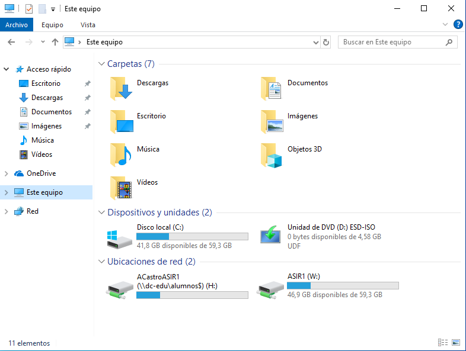
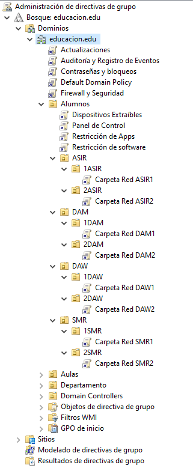

# Creación y organización de las Unidades Organizativas (UO)

El directorio estará organizado de la siguiente manera:

```
📁 educacion.edu
├── 📂 Alumnos
│ ├── 📂 ASIR
│ │ ├── 📂 1ASIR (30 alumnos)
│ │ ├── 📂 2ASIR (15 alumnos)
│ ├── 📂 SMR
│ │ ├── 📂 1SMR (30 alumnos)
│ │ ├── 📂 2SMR (15 alumnos)
│ ├── 📂 DAM
│ │ ├── 📂 1DAM (30 alumnos)
│ │ ├── 📂 2DAM (15 alumnos)
│ ├── 📂 DAW
│ │ ├── 📂 1DAW (30 alumnos)
│ │ ├── 📂 2DAW (15 alumnos)
|
│── 📂 Departamento
| ├── 📂 Profesores (15 profesores, 15 portátiles, 1 impresora, 1 recurso compartido)
│
├── 📂 Aulas
│ ├── 📂 Aula_1ASIR (15 equipos, 1 recurso compartido)
│ ├── 📂 Aula_2ASIR (15 equipos, 1 recurso compartido)
│ ├── 📂 Aula_1SMR (15 equipos, 1 recurso compartido)
│ ├── 📂 Aula_2SMR (15 equipos, 1 recurso compartido)
│ ├── 📂 Aula_1DAM (15 equipos, 1 recurso compartido)
│ ├── 📂 Aula_2DAM (15 equipos, 1 recurso compartido)
│ ├── 📂 Aula_1DAW (15 equipos, 1 recurso compartido)
│ ├── 📂 Aula_2DAW (15 equipos, 1 recurso compartido)
│
├── 📂 Grupos de Seguridad
│ ├── 📂 Grupo_Alumnos (Acceso restringido)
| ├── 📂 Grupos por cada clase (Acceso restringido) ejemplo: SMR1 SMR2
│ ├── 📂 Grupo_Profesores (Administradores)
```

Motivos:

He elegido esta distribución porque al estar todo tan separado resulta fácil aplicar permisos o GPOs a un solo ciclo o grupo en concreto sin tener que estar con exclusiones exceptuando si queremos excluir a alguien que esté en esa misma UO

También la he usado porque es muy escalable y es muy fácil añadir a un usuario nuevo a alguna UO del dominio o a algún grupo

Al tener todos una carpeta compartida para cada aula también tienes una carpeta en la que poner material de clase y reduce el almacenamiento duplicado

Y al estar separados los profesores de los alumnos también evita accesos no autorizados a recursos críticos

Para añadir los equipos se puede hacer con Click Derecho > Nuevo > Equipo

Lo mismo con las impresoras pero eligiendo > Impresora

# Automatización de alta de usuarios en el dominio

El script es el siguiente, está documentado lo que hace con comentarios dentro del script:

[Script](scriptalumnos.ps1)

## Creación de la carpeta personal

En servicios de archivos y de almacenamiento > Recursos compartidos > Creamos un nuevo recurso el cual llamaremos C:\alumnos$ y la ruta de red de la carpeta personal será \\dc-edu\alumnos$\%username%

Los permisos NTFS serán de lectura para los usuarios del dominio y de compartir para los usuarios del dominio control total

El resto de cosas relacionadas a la carpeta personal están dentro del script

Para comprobar su funcionamiento solo tendremos que conectarnos con un usuario del dominio y ver si en el Explorador de Archivos > Este Equipo tiene la unidad de red con una letra, H: en mi caso, con su nombre de logueo al dominio

# Carpeta compartida por grupo

Creamos un recurso compartido llamado grupos con los permisos NTFS sin herencia para los usuarios del dominio con solo lectura

Y permisos de compartir con Control total a usuarios del dominio

Creamos una carpeta para cada uno de los ciclos

Permisos NTFS para cada grupo con control total

Quitamos Usuarios, Usuarios del dominio y herencia

Nos dirigimos a Usuarios y Equipos de Active Directory

Creamos un nuevo recurso compartido

Y le asignamos la ruta \\dc-edu\grupos\ciclo por ejemplo\\dc-edu\grupos\ASIR1

Vamos al Administrador de directivas

Creamnos una gpo llamada Carpeta Red y el ciclo

Configuración de usuario -> Preferencias -> Configuración de Windows -> Asignacion de unidades -> Click derecho -> Nueva -> Unidad asignada

En los 3 puntos de ubicación y elegimos el recurso del grupo

Lo etiquetamos como el nombre del grupo y le asignamos una letra

Abajo le damos a Mostrar esta unidad y a Mostrar todas las unidades

Arriba en comunes, marcamos la ultima casilla y ponemos destinatarios

Nuevo elemento, Grupo de seguridad y elegimos el grupo

Forzamos la gpo con gpupdate /force y nos conectamos con un cliente



Podremos ver que tanto la carpeta personal como la grupal están creadas

# GPO

Lo configuraremos en el Administrador de directivas de grupo

Para cada una de las politicas crearemos una GPO nueva, la nombramos con el propósito de esa directiva, para que si queremos modificar o eliminar una propiedad sea mas sencillo

Para crear una GPO hay que dar click derecho al dominio o GPO al que queramos vincularla y darle a "Crear un GPO en este dominio y vincularlo aquí"

Y para editarla click derecho y "Editar"


## Políticas a nivel de dominio

### 1. Política de contraseñas y bloqueo de cuetnas

Ruta: Configuración del Equipo -> Configuración de Windows -> Configuración de seguridad -> Directivas de cuenta -> Política de contraseñas

(Para el bloqueo de cuentas en vez de Directiva de contrasñeas es en Directivas de bloqueo de cuentas que está al lado)

En esta carpeta tocaremos:

- La longitud mínima de la contraseña (8 carácteres)

- La complejidad de la contraseña (Habilitamos)

- Un tiempo de caducidad (2 meses)

- Prohibir la reutilización de contraseñas (4 contraseñas antes de poder usar la misma)

- Bloqueo de la cuenta tras intentos fallidos y que se desbloquee pidiéndolo al administrador o a los 15 mins (5 intentos y se bloquea 15 mins)

#### Justificación

Estas medidas protegen contra ataques de fuerza bruta y accesos no autorizados.

### 2. Política de Actualizaciones

Ruta: Configuración del Equipo -> Plantillas Administrativas -> Componentes de Windows -> Actualizaciones de Windows -> Activar actualizaciones recomendadas mediante Actualizaciones automáticas

Simplemente la habilitaremos

#### Justificación

Mantener los equipos en la última versión para reducir las vulnerabilidades o el riesgo de quedarnos sin soporte

### 3. Política de Auditoría y Registro de Eventos

Ruta: Configuración del Equipo -> Configuración de Windows -> Configuración de seguridad -> Configuración avanzada de auditoría -> Políticas de auditoría

En esta ubicación:

- Registraremos inicios de sesión (Inicio y cierre de sesión -> Auditara incio de sesión -> Los correctos y los erróneos)

- Auditaremos los cambios en cuentas de equipo (Administración de cuentas -> Auditar administración de cuentas de equipo -> Habilitamos correctos)

#### Justificación

Tener el poder de conocer quien inicia sesión para conocer accesos no autorizados o cuando se crea, cambia o elimina una cuenta de equipo

### 4. Política de Configuración del Firewall y Seguridad en Red

Configuración del Equipo → Configuración de Windows → Configuración de seguridad → Firewall de Windows con seguridad avanzada.

En esta ubicación:

- Restringiremos puertos y protocolos no esenciales que pueden dejar una puerta abierta añadiendo reglas de entrada de los siguientes protocolos

- Telnet 23 (Existe SSH)

- FTP 21 y 20 (Tenemos carpetas compartidas)

- RDP 3389 (Solo se permitirá a usuarios autorizados)

- IPP 631 (Impresión basada en internet no la necesitaremos porque la tenemos en rd)

- ICMP (Solo para usuarios autorizados para prevenir ataques DDoS)

(La creación de reglas funciona igual que en el firewall)

#### Justificación

Estas medidas se toman para tener una configuración por defecto del firewall que permita una seguridad en red para cerrar puertas de posibles sitios de ataque

## Políticas a la UO de Alumnos

### 5. Política de Restricción de Aplicaciones

Ruta: Configuración del ususario -> Plantillas administrativas -> Sistema -> Impedir acceso al símbolo del sistema

- Lo habilitas y no permites la ejecución de scripts

Ruta: Configuración del ususario -> Directivas -> Configuración de seguridad -> Directivas de restricción de software -> Reglas adicionales -> Click derecho -> Regla de nueva ruta de acceso

- Pones la ruta de powershell y le das a no permitido

#### Justificación

No queremos darle acceso a los alumnos a ejecutar comandos que puedan destrozar el sistema

### 6. Política de Control de Dispositivos Extraíbles

Ruta: Configuración del Equipo → Plantillas Administrativas → Sistema → Acceso a almacenamiento extraíble -> Todas las clases de almacenamiento extraíble: denegar acceso a todo

- La habilitamos

#### Justificación

Minimiza el riesgo de introducción de malware o de sacar información no debida

### 7. Política de Administrador de Tareas

Ruta: Configuración del usuario → Plantillas administrativas → Sistema → Opciones de Ctrl+Alt+Supr -> Quitar Administrador de tareas

- Lo habilitamos

#### Justificación

Denegamos el acceso a que los alumnos finalicen procesos vitales para el sistema

### 8. Política de Panel de Control

Ruta: Configuración del usuario → Plantillas administrativas → Panel de control -> Prohibir el acceso al Panel de Control y a la configuración del PC

- Lo habilitamos

#### Justificación

Evitar que los alumnos modifiquen las configuraciones del sistema

## Foto general de las políticas

