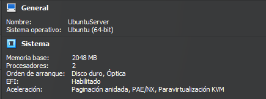

# Obtención de la máquina

Para obtener la máquina nos dirigimos a Vagrant Cloud.

En mi caso me descargué esta.


Abrimos el Visual Studio Code y en la consola el comando: **vagrant box add gusztavvargadr/ubuntu-server-2004-lts** y elegimos el hipervisor que estemos usando, en este caso Virtual Box.

Para confirmar que la hemos descargado podemos hacer vagrant box list para ver si se ha descargado correctamente.

```
vagrant box add gusztavvargadr/ubuntu-server-2004-lts
```

Ahora la iniciamos con **vagrant init gusztavvargadr/ubuntu-server-2004-lts --minimal** y empezamos a configurar la máquina.

```
vagrant init gusztavvargadr/ubuntu-server-2004-lts --minimal
```

# Configuración de la máquina

Lo primero que haremos será cambiar el nombre de host, así que nos dirigimos al Vagrantfile y configuramos el nombre de host con **config.vm.hostname = "Server-HDSM"** dentro de la línea de configuración de **Vagrant.configure("2") do |config|** y que quede tal que así.

```ruby
Vagrant.configure("2") do |config|
  config.vm.box = "gusztavvargadr/ubuntu-server-2004-lts"
  config.vm.hostname = "Server-HDSM"
end
```

# Configuración del Hipervisor

Cambiaremos la configuración del hipervisor, por lo tanto, añadiremos la línea **config.vm.provider "virtualbox" do |vb|**.

Y dentro de esta línea haremos las configuraciones de nombre de la máquina, memoria y cpu con las lineas mostradas abajo de manera que nos quedará así.

```ruby
Vagrant.configure("2") do |config|
  config.vm.box = "gusztavvargadr/ubuntu-server-2004-lts"
  config.vm.hostname = "Server-HDSM"
  config.vm.provider "virtualbox" do |vb|
    vb.name = "Ubuntu Server"
    vb.memory = 2048
    vb.cpus = 2
  end
end
```
# Compartir carpetas

Para compartir la carpeta, creamos la carpeta en el directorio deseado y en el archivo Vagrantfile escribimos la siguiente línea **config.vm.synced_folder "/data", "prueba"**

Y el archivo Vagrantfile en general quedará así:

```ruby
Vagrant.configure("2") do |config|
  config.vm.box = "gusztavvargadr/ubuntu-server-2004-lts"
  config.vm.hostname = "Server-HDSM"
  config.vm.synced_folder "data", "/data"
  config.vm.provider "virtualbox" do |vb|
    vb.name = "Ubuntu Server"
    vb.memory = 2048
    vb.cpus = 2
  end
end
```

Ahora encendemos la máquina con **vagrant up** y comprobamos si los cambios se ha realizado correctamente

Al hacer **vagrant ssh** vemos como se ha cambiado el hsotname de la máquina


Y al ver los cambios en la máquina también se han realizado correctamente



[Volver](../../index.md)