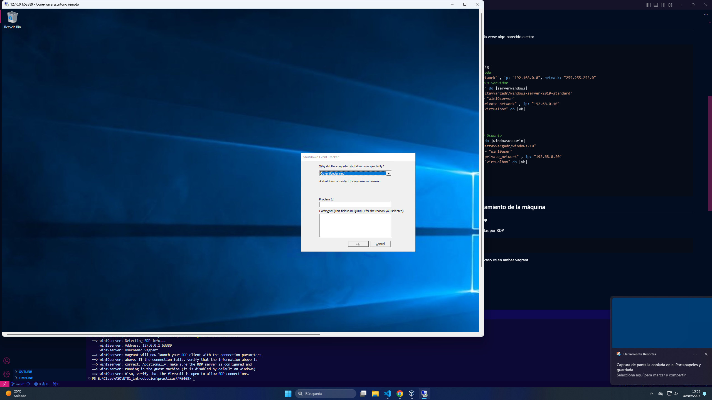
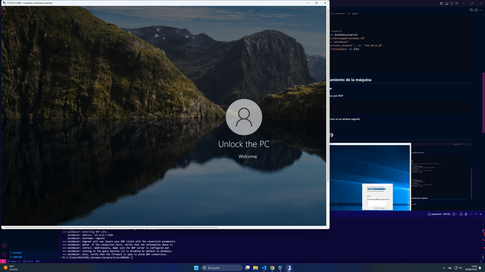

# PR012 Entornos Multimáquina

Elegimos las máquinas en mi caso usaré la **gusztavvargadr/windows-10** y la **gusztavvargadr/windows-server-2019-standard**

Inicializamos la máquina

```ruby
vagrant init --minimal
```
Y configuramos el Vagrantfile:

## Requisitos
    - Tendrá dos máquinas virtuales con los siguientes sistemas operativos y características:

    - Windows Server 2019 Standard

    - 4GB de RAM
    - 4 cores virtuales

    - Windows 10

    - 2GB de RAM
    - 2 cores virtuales

    - Las máquinas virtuales deberán estar interconectadas entre sí.
    
    - Se debe poder acceder desde equipo anfitrión a las máquinas virtuales mediante Escritorio remoto.

## Vagrantfile

Una vez configurado el Vagrantfile debería verse algo parecido a esto:

```ruby
# -*- mode: ruby -*-
# vi: set ft=ruby :

Vagrant.configure("2") do |config|
  #Configuración de la red privada
  config.vm.network "private_network" , ip: "192.168.0.0", netmask: "255.255.255.0"
  #Configuración del Windows 2019 Servidor
  config.vm.define "win19server" do |serverwindows|
    serverwindows.vm.box = "gusztavvargadr/windows-server-2019-standard"
    serverwindows.vm.hostname = "win19server"
    serverwindows.vm.network "private_network" , ip: "192.68.0.10"
    serverwindows.vm.provider "virtualbox" do |vb|
      vb.memory = "4096"
      vb.cpus = 4
    end
  end
  #Configuración del Windows 10 Usuario
  config.vm.define "win10user" do |windowsusuario|
    windowsusuario.vm.box = "gusztavvargadr/windows-10"
    windowsusuario.vm.hostname = "win10user"
    windowsusuario.vm.network "private_network" , ip: "192.68.0.20"
    windowsusuario.vm.provider "virtualbox" do |vb|
      vb.memory = "4096"
      vb.cpus = 2
    end
  end
end
```

## Comprobación del funcionamiento de la máquina

Encendemos las máquinas con **vagrant up**

Una vez encendidas nos conectamos a ellas por RDP

```
vagrant rdp win19server
vagrant rdp win10user
```

Ponemos usario y contraseña, que en mi caso es en ambas vagrant

Y vemos que nos conecta correctamente

# Windows Server 2019



# Windows 10



[Volver](../../index.md)