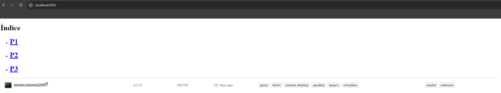
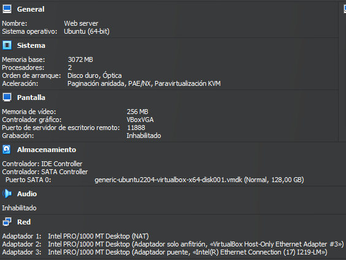
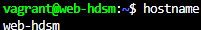

# Obtención de la máquina

Buscamos una máquina Ubuntu 22.04 yo usaré esta:


Añadimos la máquina, y podemos comprobar que existe con **vagrant box list**

```
vagrant box add generic/ubuntu2204

vagrant box list
```

Iniciamos la máquina con **vagrant init generic/ubuntu2204 --minimal** y comenzamos a configurarla

# Configuración de la máquina y del hipervisor

Realizamos la configuración básica de la máquina virtual y del hipervisor cambiando nombre, hostname, memoria y cpu y dejando la carpeta compartida en la ruta por defecto de Apache en Linux

```ruby
Vagrant.configure("2") do |config|
  config.vm.box = "generic/ubuntu2204"
  config.vm.hostname = "web-hdsm"
  config.vm.synced_folder "web", "/var/www/html"
  config.vm.provider "virtualbox" do |vb|
    vb.name = "Web server"
    vb.memory = 3072
    vb.cpus = 2
  end
end
```

# Configuración de la redes

Para configurar las redes usaremos:

```ruby
  config.vm.network :private_network, ip: "172.16.0.0", netmask: "255.255.0.0"
  config.vm.network :public_network, ip: "10.99.0.0", netmask: "255.255.0.0"
```

Y también haremos redirección de puertos para simplemente poniendo la ip del servidor en el navegador de la máquina física nos lleve directamente a la página web

```ruby
config.vm.network "forwarded_port, guest: 80, host: 8080"
```

# Automatización de la instalación de Apache

Y ahora vamos a automatizar la instalación de Apache, hay que updatear porque no está actualizado y no te instala Apache

```ruby
  config.vm.provision "shell",
    inline: "sudo apt-get update -y"

  config.vm.provision "shell",
    inline: "sudo apt-get install -y apache2"
```

# Vagrantfile

El Vagrantfile nos quedará algo así:

```ruby
# -*- mode: ruby -*-
# vi: set ft=ruby :

Vagrant.configure("2") do |config|

  config.vm.box = "generic/ubuntu2204"
  config.vm.hostname = "web-hdsm"

  config.vm.network "forwarded_port, guest: 80, host: 8080"

  config.vm.network :private_network, ip: "172.16.0.0", netmask: "255.255.0.0"
  config.vm.network :public_network, ip: "10.99.0.0", netmask: "255.255.0.0"

  config.vm.synced_folder "web", "/var/www/html"

  config.vm.provider "virtualbox" do |vb|
    vb.name = "Web server"
    vb.memory = 3072
    vb.cpus = 2
  end

  config.vm.provision "shell",
    inline: "sudo apt-get update -y"

  config.vm.provision "shell",
    inline: "sudo apt-get install -y apache2"
end
```

# Creación de la página web

Haremos 3 páginas web y 1 index todas con un título indicando la página y enlaces a las otras páginas, y en el índice pondré 1 imagen

```html

<body>
    <h1>Índice</h1>
    <ul>
        <li><a href="P1.html"><h1>P1</h1></a></li>
        <li><a href="P2.html"><h1>P2</h1></a></li>
        <li><a href="P3.html"><h1>P3</h1></a></li>
    </ul>
    
</body>

<body>
    <h1>P1</h1>
    <ul>
        <li><a href="index.html"><h1>Index</h1></a></li>
        <li><a href="P2.html"><h1>P2</h1></a></li>
        <li><a href="P3.html"><h1>P3</h1></a></li>
    </ul>
</body>

<body>
    <h1>P2</h1>
    <ul>
        <li><a href="P1.html"><h1>P1</h1></a></li>
        <li><a href="index.html"><h1>Index</h1></a></li>
        <li><a href="P3.html"><h1>P3</h1></a></li>
    </ul>
</body>

<body>
    <h1>P3</h1>
    <ul>
        <li><a href="P1.html"><h1>P1</h1></a></li>
        <li><a href="P2.html"><h1>P2</h1></a></li>
        <li><a href="index.html"><h1>Indice</h1></a></li>
    </ul>
</body>
```

Ahora hacemos **vagrant up** y booteamos la máquina

Después vamos al navegador y ponemos la IP localhost:8080 y si muestra la página significa que todo está correcto, a continuación pondré las imágenes de las configuraciones de la máquina, el hipervisor y la web

# Web



# Hipervisor



# Máquina




[Volver](../../index.md)