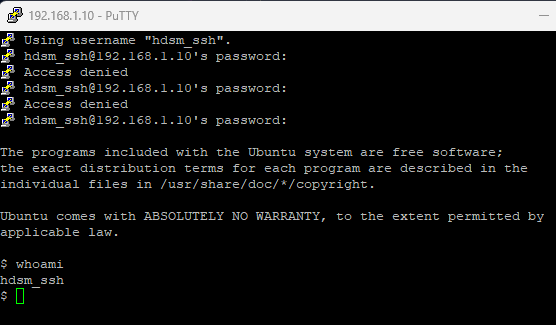

# PR0202 SSH

## 1. Preparación de la máquina y configuración de la red

Como ya tenemos la máquina descargada simplemente hacemos el

```bash
vagrant init --minimal generic/ubuntu2204
```

## Configuración del servidor

Una vez añadido el Vagrantfile configuramos la interfaz extra en solo anfitrión, cambiamos la ip, el hostname

Como pide que el hostname se cambie en el cliente configuramos el Vagrantfile con la interfaz y la ip ya que cuando enciendo la máquina la interfaz se me borra sola

```ruby
# Configuración del Ubuntu Server
  config.vm.define "ubuntuserver" do |ubuntuserver|
    ubuntuserver.vm.box = "generic/ubuntu2204"
    ubuntuserver.vm.network "private_network", ip: "192.168.1.10", hostonly: true
  end
```

Ahora iniciamos la máquina y configuramos el hostname a mano

```
vagrant up

vagrant ssh
```

Cambiamos el hostname

```bash
vagrant@ubuntu2204:~$ sudo hostname hdsm-server
vagrant@ubuntu2204:~$ hostname
hdsm-server
vagrant@ubuntu2204:~$
```

Para hacer la redirección de nombres tenemos que ir al archivo de Windows **c:\Windows\System32\Drivers\etc\hosts**, dentro de ese archivo pones el hostname y la IP del Ubuntu Server que es **hdsm-server** y **192.168.1.10**

Así debería quedar el archivo hosts

```
# Copyright (c) 1993-2009 Microsoft Corp.
#
# This is a sample HOSTS file used by Microsoft TCP/IP for Windows.
#
# This file contains the mappings of IP addresses to host names. Each
# entry should be kept on an individual line. The IP address should
# be placed in the first column followed by the corresponding host name.
# The IP address and the host name should be separated by at least one
# space.
#
# Additionally, comments (such as these) may be inserted on individual
# lines or following the machine name denoted by a '#' symbol.
#
# For example:
#
#      102.54.94.97     rhino.acme.com          # source server
#       38.25.63.10     x.acme.com              # x client host

# localhost name resolution is handled within DNS itself.
#	127.0.0.1       localhost
#	::1             localhost
192.168.1.10		hdsm-server
```

## 2. Creación del usuario y conexión SSH

Creamos el usuario

```bash
vagrant@ubuntu2204:~$ sudo useradd -m hdsm_ssh
vagrant@ubuntu2204:~$
vagrant@ubuntu2204:~$ sudo cat /etc/shadow
hdsm_ssh:!:20004:0:99999:7:::
```

### Instalación del servidor SSH

```bash
vagrant@ubuntu2204:~$ sudo apt install openssh-server
# Comprobar que se ha instalado
vagrant@ubuntu2204:~$ ls /etc/ssh
```

### Conexión SSH

Ahora instalamos el PuTTY y ponemos la IP, el puerto y seleccionamos conexión SSH

Y ya se podrán conectar a ti sin usar contraseña

(También se puede hacer desde la consola como en linux)

```batch
C:\Users\Alumno>ssh vagrant@192.168.1.10
The authenticity of host '192.168.1.10 (192.168.1.10)' can't be established.
ED25519 key fingerprint is SHA256:AitBIBfK8AFy4Q31ND4ddnuLA53Vtf9/Rnd7sGitY0E.
This key is not known by any other names
Are you sure you want to continue connecting (yes/no/[fingerprint])? tes
Please type 'yes', 'no' or the fingerprint: yes
Warning: Permanently added '192.168.1.10' (ED25519) to the list of known hosts.
vagrant@192.168.1.10's password:
Last login: Tue Oct 15 08:17:01 2024 from 192.168.1.1
vagrant@ubuntu2204:~$
```



### Configuración de claves

Generamos la clave con ssh-keygen en el cliente

```batch
C:\Users\Alumno>ssh-keygen
Generating public/private rsa key pair.
Enter file in which to save the key (C:\Users\Alumno/.ssh/id_rsa):
Created directory 'C:\\Users\\Alumno/.ssh'.
Enter passphrase (empty for no passphrase):
Enter same passphrase again:
Your identification has been saved in C:\Users\Alumno/.ssh/id_rsa
Your public key has been saved in C:\Users\Alumno/.ssh/id_rsa.pub
The key fingerprint is:
SHA256:rVIZ6IZiOHRqbhKLHGSiCxXGCWlYBNhFTUMvf4GT9Z0 alumno@ED24016481P056
The key's randomart image is:
+---[RSA 3072]----+
|=O=+o++   .      |
|+o+.  .+ + . . . |
|o+..  o * . . E  |
|*oo  o o = .     |
|*+o . o S o      |
|**.. . . o       |
|=+    . .        |
|o      .         |
|                 |
+----[SHA256]-----+
```
Y ahora en el usuario del servidor al que queramos acceder la conexión SSH realizamos lo mismo

```bash
hdsm_ssh@ubuntu2204:~$ ssh-keygen
Generating public/private rsa key pair.
Enter file in which to save the key (/home/hdsm_ssh/.ssh/id_rsa): 
Created directory '/home/hdsm_ssh/.ssh'.
Enter passphrase (empty for no passphrase):
Enter same passphrase again:
Your identification has been saved in /home/hdsm_ssh/.ssh/id_rsa
Your public key has been saved in /home/hdsm_ssh/.ssh/id_rsa.pub
The key fingerprint is:
SHA256:Sc6tR0AYT/DC+0ir0dBP+J+7uxFJP2DVNrBmZUMUCGg hdsm_ssh@ubuntu2204.localdomain
The key's randomart image is:
+---[RSA 3072]----+
|      o+o...o*B. |
|     ..=E  ..++. |
|      o.= + +. . |
|     . B * *     |
|    . = S = o    |
|     + B o . .   |
|    . + = o      |
|     o   o o     |
|    .     B=     |
+----[SHA256]-----+
```

Y la pasamos al servidor con scp

```bash
C:\Users\Alumno>scp C:\Users\Alumno/.ssh/id_rsa.pub hdsm_ssh@192.168.1.10:/home/hdsm_ssh/.ssh/
The authenticity of host '192.168.1.10 (192.168.1.10)' can't be established.
ED25519 key fingerprint is SHA256:ZjnoZVl3aMgbAWL1fTMyaEAXKkzE6tFr48+Q8FRXspQ.
This key is not known by any other names
Are you sure you want to continue connecting (yes/no/[fingerprint])?
Warning: Permanently added '192.168.1.10' (ED25519) to the list of known hosts.
hdsm_ssh@192.168.1.10's password:
id_rsa.pub   
```

(Si te da un error como este)
```batch
@@@@@@@@@@@@@@@@@@@@@@@@@@@@@@@@@@@@@@@@@@@@@@@@@@@@@@@@@@@
@    WARNING: REMOTE HOST IDENTIFICATION HAS CHANGED!     @
@@@@@@@@@@@@@@@@@@@@@@@@@@@@@@@@@@@@@@@@@@@@@@@@@@@@@@@@@@@
```
Tienes que borrar el registro del servidor poniendo el siguiente comando en el cliente

```batch
C:\Users\Alumno>ssh-keygen -R 192.168.1.10
# Host 192.168.1.10 found: line 1
# Host 192.168.1.10 found: line 2
# Host 192.168.1.10 found: line 3
C:\Users\Alumno/.ssh/known_hosts updated.
Original contents retained as C:\Users\Alumno/.ssh/known_hosts.old
```

En el servidor copias el archivo id_rsa.pub a authorized_keys

```bash
hdsm_ssh@ubuntu2204:~/.ssh$ cp /home/hdsm_ssh/.ssh/id_rsa.pub /home/hdsm_ssh/.ssh/authorized_keys
hdsm_ssh@ubuntu2204:~/.ssh$ ls -la
total 20
drwx------ 2 hdsm_ssh hdsm_ssh 4096 Oct 15 10:43 .
drwxr-x--- 4 hdsm_ssh hdsm_ssh 4096 Oct 15 10:42 ..
-rw-r--r-- 1 hdsm_ssh hdsm_ssh  576 Oct 15 10:43 authorized_keys
-rw------- 1 hdsm_ssh hdsm_ssh 2622 Oct 15 10:36 id_rsa
-rw-r--r-- 1 hdsm_ssh hdsm_ssh  576 Oct 15 10:39 id_rsa.pub
hdsm_ssh@ubuntu2204:~/.ssh$
```

Simplemente hacemos el ssh y ya funciona sin contraseña

```batch
C:\Users\Alumno>ssh hdsm_ssh@192.168.1.10
hdsm_ssh@ubuntu2204:~$
```

[Volver](../../index.md)