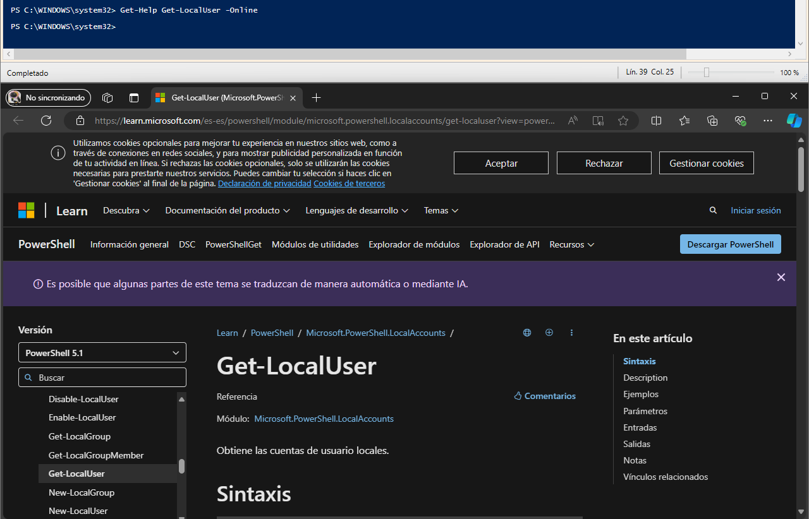
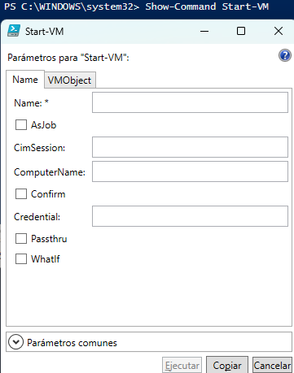
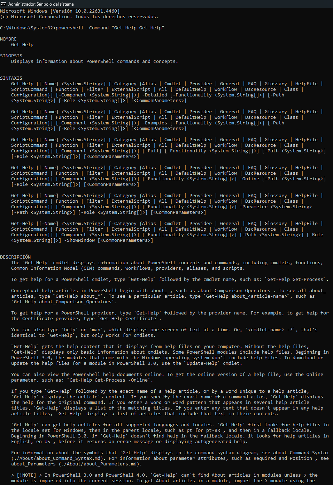

# 1. Obtén ejemplos de utilización del comando Get-LocalUser.

```powershell
Get-Help Get-LocalUser -Examples
PS C:\Users\Alumno> Get-Help Get-LocalUser -Examples

NOMBRE
    Get-LocalUser
    
SINOPSIS
    Gets local user accounts.
    
    
    --------- Example 1: Get an account by using its name ---------
    
    Get-LocalUser -Name "AdminContoso02"
    
    Name             Enabled Description
    ----             ------- -----------
    AdminContoso02   True    Description of this account.
    
    
    Example 2: Get an account that is connected to a Microsoft account
    
    Get-LocalUser -Name "MicrosoftAccount\username@Outlook.com"
    
    Name                                    Enabled  Description
    ----                                    -------  -----------
    MicrosoftAccount\username@outlook.com  True     Description of this account.
    
    
    ----- Example 3: Get an account that has the specified SID -----
    
    Get-LocalUser -SID S-1-5-21-9526073513-1762370368-3942940353-500
    
    Name          Enabled Description
    ----          ------- -----------
    Administrator True    Built-in account for administering the computer/domain
    
    


PS C:\Users\Alumno> 
```

# 2. Obtén un listado de todos los comandos relacionados con la gestión de usuarios locales (es decir, con el nombre LocalUser).

```powershell
    PS C:\WINDOWS\system32> Get-Command -Name *LocalUser*

    CommandType     Name                                               Version      Source                                                                                    
    -----------     ----                                               -------      ------                                                                                    
    Cmdlet          Disable-LocalUser                                  1.0.0.0    Microsoft.    PowerShell.LocalAccounts                                                        
    Cmdlet          Enable-LocalUser                                   1.0.0.0    Microsoft.    PowerShell.LocalAccounts                                                        
    Cmdlet          Get-LocalUser                                      1.0.0.0    Microsoft.    PowerShell.LocalAccounts                                                        
    Cmdlet          New-LocalUser                                      1.0.0.0    Microsoft.    PowerShell.LocalAccounts                                                        
    Cmdlet          Remove-LocalUser                                   1.0.0.0    Microsoft.    PowerShell.LocalAccounts                                                        
    Cmdlet          Rename-LocalUser                                   1.0.0.0    Microsoft.    PowerShell.LocalAccounts                                                        
    Cmdlet          Set-LocalUser                                      1.0.0.0    Microsoft.    PowerShell.LocalAccounts
```

# 3. Utilizando la línea de comandos, muestra en el navegador la ayuda del comando Get-LocalUser.

```powershell
    Get-Help Get-LocalUser -Online
```



# 4. Averigua para qué sirve el comando Set-Content y explícalo brevemente con tus palabras.

Este comando sirve para escribir archivos desde Powershell indicándole la ruta al archivo y el contenido que quieres insertar

También puede sobreescribir archivos

Con -Force si el archivo no existe te lo crea

# 5. Explica tres formas diferentes de ver o buscar un comando que hayas utilizado anteriormente en tu sesión.

Con las flechas del teclado para arriba y para abajo

Con History, Get-History (Te sale el historial de comandos) e Invoke-History (Te ejecuta el último comando que se haya ejecutado en el Powershell)

```powershell
PS C:\WINDOWS\system32> Get-History

  Id CommandLine                                                                                                                                                        
  -- -----------                                                                                                                                                        
   1 Get-LocalUser -Name Alumno                                                                                                                                         
   2 Get-LocalUser                                                                                                                                                      
   3 Get-Command -Name *LocalUser*                                                                                                                                      
   4 Get-Help Get-LocalUser -Online                                                                                                                                     
   5 Get-History                                                                                                                     


PS C:\WINDOWS\system32> Invoke-History
Get-History

  Id CommandLine                                                                                                                                                        
  -- -----------                                                                                                                                                        
   1 Get-LocalUser -Name Alumno                                                                                                                                         
   2 Get-LocalUser                                                                                                                                                      
   3 Get-Command -Name *LocalUser*                                                                                                                                      
   4 Get-Help Get-LocalUser -Online                                                                                                                                     
   5 Get-History                                                                                                                      
```

# 6. Averigua si el comando Get-Process tienen un parámetro llamado ComputerName y en caso afirmativo explica para qué sirve.

Si, el parámetro ComputerName sirve para obtener los procesos de un equipo remoto

Sintaxis: Get-Process ComputerName (Nombre del equipo)

# 7. Muestra la ayuda del comando Start-VM en una ventana emergente.



# 8. Muestra la ayuda del comando Get-Help en el navegador invocándolo desde la línea de comandos.



# 9. Muestra las últimas 20 entradas del historial.

```powershell
PS C:\WINDOWS\system32> Get-History | Select-Object -Last 20

  Id CommandLine                                                                                                                                                        
  -- -----------                                                                                                                                                        
   1 Get-LocalUser -Name Alumno                                                                                                                                         
   2 Get-LocalUser                                                                                                                                                      
   3 Get-Command -Name *LocalUser*                                                                                                                                      
   4 Get-Help Get-LocalUser -Online                                                                                                                                     
   5 Get-History                                                                                                                                                        
   6 Get-Content "$env:APPDATA\Microsoft\Windows\PowerShell\PSReadLine\ConsoleHost_history.txt"...                                                                      
   7 Get-Content "$env:APPDATA\Microsoft\Windows\PowerShell\PSReadLine\ConsoleHost_history.txt"...                                                                      
   8 Get-History                                                                                                                                                        
   9 Get-History                                                                                                                                                        
  10 Get-Process -ComputerName Alumno                                                                                                                                   
  11 Show-Command Start-VM                                                                                                                                              
  12 Get-Help Get-Help                                                                                                                                                  
  13 Get-Help Get-Help                                                                                                                                                  
  14 Get-History -Tail 20
```

# 10. Elimina las entradas 10, 12 y 14 de tu historial.

```powershell
PS C:\WINDOWS\system32> Clear-History -Id 10

PS C:\WINDOWS\system32> Clear-History -Id 12

PS C:\WINDOWS\system32> Clear-History -Id 14

PS C:\WINDOWS\system32> Get-History | Select-Object -Last 20

  Id CommandLine                                                                                                                                                        
  -- -----------                                                                                                                                                        
   1 Get-LocalUser -Name Alumno                                                                                                                                         
   2 Get-LocalUser                                                                                                                                                      
   3 Get-Command -Name *LocalUser*                                                                                                                                      
   4 Get-Help Get-LocalUser -Online                                                                                                                                     
   5 Get-History                                                                                                                                                        
   6 Get-Content "$env:APPDATA\Microsoft\Windows\PowerShell\PSReadLine\ConsoleHost_history.txt"...                                                                      
   7 Get-Content "$env:APPDATA\Microsoft\Windows\PowerShell\PSReadLine\ConsoleHost_history.txt"...                                                                      
   8 Get-History                                                                                                                                                        
   9 Get-History                                                                                                                                                        
  11 Show-Command Start-VM                                                                                                                                              
  13 Get-Help Get-Help                                                                                                                                                  
  15 Get-History | Select-Object -Last 20                                                                                                                               
  16 Clear-History -Id                                                                                                                                                  
  17 Clear-History -Id 10                                                                                                                                               
  18 Clear-History -Id 12                                                                                                                                               
  19 Clear-History -Id 14                                                                                                                                               


PS C:\WINDOWS\system32> 
```

[Volver](../../index.md)