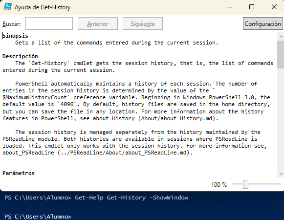

# PR0402: Introducción a Powershell II

# 1. Visualiza las últimas cinco entradas del historial, mostrando para cada una el comando, la hora en que finalizó su ejecución y el estado de ejecución.

```powershell
PS C:\Users\Alumno> Get-History | Select-Object -Last 5 | Format-Table CommandLine, EndExecutionTime, ExecutionStatus

PS C:\Users\Alumno> 
```

No tengo salida del comando porque acabo de iniciar el ordenador

# 2. Ejecuta el comando Get-Command (que muestra todos los comandos disponibles en Powershell) e interrúmpelo antes de que finalice su ejecución pulsando las teclas Ctrl-C. A continuación, ejecútalo dejando que finalice correctamente.


# 3. Vuelve a ejecutar el comando del punto 1 y comprueba las diferentes salidas de finalización de estado de ejecución.

```powershell
PS C:\Users\Alumno> Get-History | Select-Object -Last 5 | Format-Table CommandLine, EndexEcutionTime, ExecutionStatus

CommandLine                                                                                       EndExecutionTime   ExecutionStatus
-----------                                                                                       ----------------   ---------------
Get-Command                                                                                       03/12/2024 8:44:40         Stopped
Get-Command                                                                                       03/12/2024 8:44:47         Stopped
Get-History | Select-Object -Last 5                                                               03/12/2024 8:46:31       Completed
notepad $PROFILE                                                                                  03/12/2024 8:47:51       Completed
Get-History | Select-Object -Last 5 | Format-Table CommandLine, EndexEcutionTime, ExecutionStatus 03/12/2024 8:50:07       Completed
```

# 4. Muestra todos los procesos con el nombre msedge mostrando para cada uno el identificador, el consumo de CPU y los hilos (threads)

```powershell

PS C:\Users\Alumno> Get-Process -Name msedge | Select-Object Id, CPU, Threads

   Id     CPU Threads                        
   --     --- -------                        
 3884 0,03125 {13936, 9492, 14884, 13360...} 
13040   0,125 {12828, 13512, 15040, 14544...}
13124     0,5 {13248, 12976, 14604, 15356...}
13616       0 {13592, 13440, 13436, 13432...}
15252       0 {14184, 15048, 15020, 15044...}


PS C:\Users\Alumno> 
```

# 5. Averigua para qué sirve el parámetro -Delimiter del comando Export-CSV

Ese parámetro es utilizado para especificar el separador del archivo csv a crear y se usaría de la siguiente manera:

```powershell
Export-Csv -Path (Ruta) -Delimeter (Carácter)
Export-Csv -Path C:\xampp\htdocs -Delimeter ' '
```

# 6. Muestra en una ventana la ayuda del comando Get-History



# 7. Muestra un listado con todos los comandos que tengan el verbo Update.

```powershell
PS C:\Users\Alumno> Get-Command -Verb Update


CommandType     Name                                               Version    Source                                                                                    
-----------     ----                                               -------    ------                                                                                    
Function        Update-AutologgerConfig                            1.0.0.0    EventTracingManagement                                                                    
Function        Update-Disk                                        2.0.0.0    Storage                                                                                   
Function        Update-DscConfiguration                            1.1        PSDesiredStateConfiguration                                                               
Function        Update-EtwTraceSession                             1.0.0.0    EventTracingManagement                                                                    
Function        Update-HostStorageCache                            2.0.0.0    Storage                                                                                   
Function        Update-IscsiTarget                                 1.0.0.0    iSCSI                                                                                     
Function        Update-IscsiTargetPortal                           1.0.0.0    iSCSI                                                                                     
Function        Update-Module                                      1.0.0.1    PowerShellGet                                                                             
Function        Update-ModuleManifest                              1.0.0.1    PowerShellGet                                                                             
Function        Update-MpSignature                                 1.0        ConfigDefender                                                                            
Function        Update-MpSignature                                 1.0        Defender                                                                                  
Function        Update-NetFirewallDynamicKeywordAddress            2.0.0.0    NetSecurity                                                                               
Function        Update-NetIPsecRule                                2.0.0.0    NetSecurity                                                                               
Function        Update-Script                                      1.0.0.1    PowerShellGet                                                                             
Function        Update-ScriptFileInfo                              1.0.0.1    PowerShellGet                                                                             
Function        Update-SmbMultichannelConnection                   2.0.0.0    SmbShare                                                                                  
Function        Update-StorageBusCache                             1.0.0.0    StorageBusCache                                                                           
Function        Update-StorageFirmware                             2.0.0.0    Storage                                                                                   
Function        Update-StoragePool                                 2.0.0.0    Storage                                                                                   
Function        Update-StorageProviderCache                        2.0.0.0    Storage                                                                                   
Cmdlet          Update-FormatData                                  3.1.0.0    Microsoft.PowerShell.Utility                                                              
Cmdlet          Update-Help                                        3.0.0.0    Microsoft.PowerShell.Core                                                                 
Cmdlet          Update-LapsADSchema                                1.0.0.0    LAPS                                                                                      
Cmdlet          Update-List                                        3.1.0.0    Microsoft.PowerShell.Utility                                                              
Cmdlet          Update-TypeData                                    3.1.0.0    Microsoft.PowerShell.Utility                                                              
Cmdlet          Update-UevTemplate                                 2.1.639.0  UEV                                                                                       
Cmdlet          Update-VMVersion                                   2.0.0.0    Hyper-V                                                                                   
Cmdlet          Update-WIMBootEntry                                3.0        Dism                                                                                      


PS C:\Users\Alumno> 
```

# 8. Ejecuta la herramienta Recortes y localízala usando el comando Get-Process teniendo en cuenta que el proceso se llama SnippingTool.exe

```powershell
PS C:\Users\Alumno> Get-Process -Name SnippingTool

Handles  NPM(K)    PM(K)      WS(K)     CPU(s)     Id  SI ProcessName                                                                                                   
-------  ------    -----      -----     ------     --  -- -----------                                                                                                   
   2695      57    69172     102356       0,06  13980   1 SnippingTool                                                                                                  


PS C:\Users\Alumno> 
```

# 9. Averigua qué propiedades tienen los procesos devueltos con el comando Get-Process.

```powershell
PS C:\Users\Alumno> Get-Process | Get-Member -MemberType Properties


   TypeName: System.Diagnostics.Process

Name                       MemberType     Definition                                                                         
----                       ----------     ----------                                                                         
Handles                    AliasProperty  Handles = Handlecount                                                              
Name                       AliasProperty  Name = ProcessName                                                                 
NPM                        AliasProperty  NPM = NonpagedSystemMemorySize64                                                   
PM                         AliasProperty  PM = PagedMemorySize64                                                             
SI                         AliasProperty  SI = SessionId                                                                     
VM                         AliasProperty  VM = VirtualMemorySize64                                                           
WS                         AliasProperty  WS = WorkingSet64                                                                  
__NounName                 NoteProperty   string __NounName=Process                                                          
BasePriority               Property       int BasePriority {get;}                                                            
Container                  Property       System.ComponentModel.IContainer Container {get;}                                  
EnableRaisingEvents        Property       bool EnableRaisingEvents {get;set;}                                                
ExitCode                   Property       int ExitCode {get;}                                                                
ExitTime                   Property       datetime ExitTime {get;}                                                           
Handle                     Property       System.IntPtr Handle {get;}                                                        
HandleCount                Property       int HandleCount {get;}                                                             
HasExited                  Property       bool HasExited {get;}                                                              
Id                         Property       int Id {get;}                                                                      
MachineName                Property       string MachineName {get;}                                                          
MainModule                 Property       System.Diagnostics.ProcessModule MainModule {get;}                                 
MainWindowHandle           Property       System.IntPtr MainWindowHandle {get;}                                              
MainWindowTitle            Property       string MainWindowTitle {get;}                                                      
MaxWorkingSet              Property       System.IntPtr MaxWorkingSet {get;set;}                                             
MinWorkingSet              Property       System.IntPtr MinWorkingSet {get;set;}                                             
Modules                    Property       System.Diagnostics.ProcessModuleCollection Modules {get;}                          
NonpagedSystemMemorySize   Property       int NonpagedSystemMemorySize {get;}                                                
NonpagedSystemMemorySize64 Property       long NonpagedSystemMemorySize64 {get;}                                             
PagedMemorySize            Property       int PagedMemorySize {get;}                                                         
PagedMemorySize64          Property       long PagedMemorySize64 {get;}                                                      
PagedSystemMemorySize      Property       int PagedSystemMemorySize {get;}                                                   
PagedSystemMemorySize64    Property       long PagedSystemMemorySize64 {get;}                                                
PeakPagedMemorySize        Property       int PeakPagedMemorySize {get;}                                                     
PeakPagedMemorySize64      Property       long PeakPagedMemorySize64 {get;}                                                  
PeakVirtualMemorySize      Property       int PeakVirtualMemorySize {get;}                                                   
PeakVirtualMemorySize64    Property       long PeakVirtualMemorySize64 {get;}                                                
PeakWorkingSet             Property       int PeakWorkingSet {get;}                                                          
PeakWorkingSet64           Property       long PeakWorkingSet64 {get;}                                                       
PriorityBoostEnabled       Property       bool PriorityBoostEnabled {get;set;}                                               
PriorityClass              Property       System.Diagnostics.ProcessPriorityClass PriorityClass {get;set;}                   
PrivateMemorySize          Property       int PrivateMemorySize {get;}                                                       
PrivateMemorySize64        Property       long PrivateMemorySize64 {get;}                                                    
PrivilegedProcessorTime    Property       timespan PrivilegedProcessorTime {get;}                                            
ProcessName                Property       string ProcessName {get;}                                                          
ProcessorAffinity          Property       System.IntPtr ProcessorAffinity {get;set;}                                         
Responding                 Property       bool Responding {get;}                                                             
SafeHandle                 Property       Microsoft.Win32.SafeHandles.SafeProcessHandle SafeHandle {get;}                    
SessionId                  Property       int SessionId {get;}                                                               
Site                       Property       System.ComponentModel.ISite Site {get;set;}                                        
StandardError              Property       System.IO.StreamReader StandardError {get;}                                        
StandardInput              Property       System.IO.StreamWriter StandardInput {get;}                                        
StandardOutput             Property       System.IO.StreamReader StandardOutput {get;}                                       
StartInfo                  Property       System.Diagnostics.ProcessStartInfo StartInfo {get;set;}                           
StartTime                  Property       datetime StartTime {get;}                                                          
SynchronizingObject        Property       System.ComponentModel.ISynchronizeInvoke SynchronizingObject {get;set;}            
Threads                    Property       System.Diagnostics.ProcessThreadCollection Threads {get;}                          
TotalProcessorTime         Property       timespan TotalProcessorTime {get;}                                                 
UserProcessorTime          Property       timespan UserProcessorTime {get;}                                                  
VirtualMemorySize          Property       int VirtualMemorySize {get;}                                                       
VirtualMemorySize64        Property       long VirtualMemorySize64 {get;}                                                    
WorkingSet                 Property       int WorkingSet {get;}                                                              
WorkingSet64               Property       long WorkingSet64 {get;}                                                           
Company                    ScriptProperty System.Object Company {get=$this.Mainmodule.FileVersionInfo.CompanyName;}          
CPU                        ScriptProperty System.Object CPU {get=$this.TotalProcessorTime.TotalSeconds;}                     
Description                ScriptProperty System.Object Description {get=$this.Mainmodule.FileVersionInfo.FileDescription;}  
FileVersion                ScriptProperty System.Object FileVersion {get=$this.Mainmodule.FileVersionInfo.FileVersion;}      
Path                       ScriptProperty System.Object Path {get=$this.Mainmodule.FileName;}                                
Product                    ScriptProperty System.Object Product {get=$this.Mainmodule.FileVersionInfo.ProductName;}          
ProductVersion             ScriptProperty System.Object ProductVersion {get=$this.Mainmodule.FileVersionInfo.ProductVersion;}


PS C:\Users\Alumno> 
```

# 10. Busca en la ayuda para qué sirve el parámetro -MemberType del comando Get-Member.

```powershell
PS C:\Users\Alumno> Get-Help -Name Get-Member -Parameter MemberType

-MemberType <System.Management.Automation.PSMemberTypes>
    Specifies the member type that this cmdlet gets. The default is `All`.
    
    The acceptable values for this parameter are:
    
    - `AliasProperty`
    
    - `CodeProperty`
    
    - `Property`
    
    - `NoteProperty`
    
    - `ScriptProperty`
    
    - `Properties`
    
    - `PropertySet`
    
    - `Method`
    
    - `CodeMethod`
    
    - `ScriptMethod`
    
    - `Methods`
    
    - `ParameterizedProperty`
    
    - `MemberSet`
    
    - `Event`
    
    - `Dynamic`
    
    - `All`
    
    
    These values are defined as a flag-based enumeration. You can combine multiple values together to set multiple flags using this parameter. The values can be passed 
    to the MemberType parameter as an array of values or as a comma-separated string of those values. The cmdlet will combine the values using a binary-OR operation. 
    Passing values as an array is the simplest option and also allows you to use tab-completion on the values.
    
    For information about these values, see PSMemberTypes Enumeration (/dotnet/api/system.management.automation.psmembertypes).
    Not all objects have every type of member. If you specify a member type that the object doesn't have, PowerShell returns a null value. To get related types of 
    members, such as all extended members, use the View parameter. If you use the MemberType parameter with the Static or View parameters, `Get-Member` gets the 
    members that belong to both sets.
    
    
    ¿Requerido?                  false
    ¿Posición?                   named
    Valor predeterminado         None
    ¿Aceptar canalización?       False
    ¿Aceptar caracteres comodín? false
    


PS C:\Users\Alumno> 
```

# 11. Desde la línea de comandos, finaliza la ejecución de la herramienta Recortes.

```powershell
PS C:\Users\Alumno> Stop-Process -Name SnippingTool

PS C:\Users\Alumno> 
```

# 12. Muestra todos los procesos que tienen el nombre svchost.

```powershell
PS C:\Users\Alumno> Get-Process -Name svchost

Handles  NPM(K)    PM(K)      WS(K)     CPU(s)     Id  SI ProcessName                                                                                                   
-------  ------    -----      -----     ------     --  -- -----------                                                                                                   
    278      12     3516       9540              1072   0 svchost                                                                                                       
    273      13     2580      13204              1180   0 svchost                                                                                                       
    309      11     2316      10248              1368   0 svchost                                                                                                       
    261      14     3172      11340              1388   0 svchost                                                                                                       
    361      20     4376      11084              1628   0 svchost                                                                                                       
   1360      29    10824      28952              1692   0 svchost                                                                                                       
   1435      23     9044      17504              1828   0 svchost                                                                                                       
    363      15     3204      10900              1880   0 svchost                                                                                                       
    111      13     1300       5612              1968   0 svchost                                                                                                       
    124       8     1328       5608              1992   0 svchost                                                                                                       
    194      12     1632       7164              2000   0 svchost                                                                                                       
    167      31     6692      10968              2008   0 svchost                                                                                                       
    128      11     1512       6056              2132   0 svchost                                                                                                       
    455      35    13884      24504              2192   0 svchost                                                                                                       
   1196      25     7160      18784              2228   0 svchost                                                                                                       
    381      18     3120      12052              2300   0 svchost                                                                                                       
   1908      18    17452      28580              2536   0 svchost                                                                                                       
    408      19     6664      17404              2644   0 svchost                                                                                                       
    136       9     1616       7864              2752   0 svchost                                                                                                       
    193      11     2260       8156              2840   0 svchost                                                                                                       
    197      11     2408      11128              2968   0 svchost                                                                                                       
    271      15     2744       8656              2976   0 svchost                                                                                                       
    350      14     3972      13972              2984   0 svchost                                                                                                       
    170      13     1760       7732              2992   0 svchost                                                                                                       
    249      14     3272      12644              3108   0 svchost                                                                                                       
    258      12     3260      12496              3120   0 svchost                                                                                                       
    217      11     2024       9028              3212   0 svchost                                                                                                       
    227      13     2256       9580              3244   0 svchost                                                                                                       
    139       9     1572       7476              3344   0 svchost                                                                                                       
    451      15    18404      22452              3352   0 svchost                                                                                                       
    363      21     4676      19192              3424   0 svchost                                                                                                       
    184      12     1980       8252              3464   0 svchost                                                                                                       
    198       8     1792       6616              3532   0 svchost                                                                                                       
    173      26     1968       7512              3616   0 svchost                                                                                                       
    231      16    11024      19376              3668   0 svchost                                                                                                       
    186      10     2040       8364              3744   0 svchost                                                                                                       
    254      14     2684      12744              3928   0 svchost                                                                                                       
    272       8     1460       6180              3936   0 svchost                                                                                                       
    194      13     1984       8952              3944   0 svchost                                                                                                       
    320      11    12804      21140              4024   0 svchost                                                                                                       
    417      17     5952      15616              4184   0 svchost                                                                                                       
    126       8     1380       7028              4252   0 svchost                                                                                                       
    299      16     4256      20116              4340   0 svchost                                                                                                       
    385      28     4912      16084              4404   0 svchost                                                                                                       
    423      14     3460      14580              4576   0 svchost                                                                                                       
    657      27     9840      44812       0,53   5300   1 svchost                                                                                                       
    260      14     2940      13096       0,00   5444   1 svchost                                                                                                       
    229      11     2420       9120              5696   0 svchost                                                                                                       
    168       9     1544       7792              6260   0 svchost                                                                                                       
    495      16     3436      12720              6324   0 svchost                                                                                                       
    227      12     2484      11104              6336   0 svchost                                                                                                       
    235      15     2680      12780              6380   0 svchost                                                                                                       
    758      35    25004      52364              6736   0 svchost                                                                                                       
    386      27    18488      26620              6748   0 svchost                                                                                                       
    189       9     1540       7632              6772   0 svchost                                                                                                       
    145       8     1328       6276              6840   0 svchost                                                                                                       
    392      19     4116      18632              6908   0 svchost                                                                                                       
    230      14     3200      11592              7116   0 svchost                                                                                                       
    422      22     5204      17688              7320   0 svchost                                                                                                       
    263      17     3460      13156              7420   0 svchost                                                                                                       
    220      12     3148      12820              7480   0 svchost                                                                                                       
    204      11     2624      11676              7736   0 svchost                                                                                                       
    248      14     3292      14060              8112   0 svchost                                                                                                       
    237      14     2972      12916              8616   0 svchost                                                                                                       
    254      26     2048       8380              8900   0 svchost                                                                                                       
    247      13     7748      16108              9240   0 svchost                                                                                                       
    147       9     1576       6900              9292   0 svchost                                                                                                       
    521      23    17832      43716       0,33   9460   1 svchost                                                                                                       
    358      16     4832      24552       0,03   9512   1 svchost                                                                                                       
    149       9     2124       9148       0,00   9584   1 svchost                                                                                                       
    282      15     3832      18572       0,02  10260   1 svchost                                                                                                       
    160      42     1740       8056             10420   0 svchost                                                                                                       
    172      10     2008      10956       0,00  10480   1 svchost                                                                                                       
    153       9     1748      10120       0,00  10792   1 svchost                                                                                                       
    183      11     2132       9884             12220   0 svchost                                                                                                       
    469      19     4536      21452             12652   0 svchost                                                                                                       
    325      17     8884      24276             14596   0 svchost                                                                                                       
    178      10     1892       7804             16124   0 svchost                                                                                                       
    392      23     3500      14184             16336   0 svchost                                                                                                       


PS C:\Users\Alumno> 
```

# 13. Muestra por pantalla el número de instancias del proceso svchost.

```powershell
PS C:\Users\Alumno> (Get-Process -Name svchost).Count
80
```

# 14. Muestra por pantalla todos los procesos con el nombre svchost mostrando para cada uno: nombre, identificador, hora de inicio, tiempo total de procesador y clase de prioridad. Se deben mostrar de forma tabular.

```powershell

PS C:\Users\Alumno> Get-Process -Name svchost | Select-Object Name, Id, StartTime, CPU, PriorityClass | Format-Table


Name       Id StartTime          CPU      PriorityClass
----       -- ---------          ---      -------------
svchost  1072                                          
svchost  1180                                          
svchost  1368                                          
svchost  1388                                          
svchost  1628                                          
svchost  1692                                          
svchost  1828                                          
svchost  1880                                          
svchost  1968                                          
svchost  1992                                          
svchost  2000                                          
svchost  2008                                          
svchost  2132                                          
svchost  2192                                          
svchost  2228                                          
svchost  2300                                          
svchost  2536                                          
svchost  2644                                          
svchost  2752                                          
svchost  2840                                          
svchost  2968                                          
svchost  2976                                          
svchost  2984                                          
svchost  2992                                          
svchost  3108                                          
svchost  3120                                          
svchost  3212                                          
svchost  3244                                          
svchost  3344                                          
svchost  3352                                          
svchost  3424                                          
svchost  3464                                          
svchost  3532                                          
svchost  3616                                          
svchost  3668                                          
svchost  3744                                          
svchost  3928                                          
svchost  3936                                          
svchost  3944                                          
svchost  4024                                          
svchost  4184                                          
svchost  4252                                          
svchost  4340                                          
svchost  4404                                          
svchost  4496                                          
svchost  4576                                          
svchost  5300 03/12/2024 8:40:00 0,546875 Normal       
svchost  5444 03/12/2024 8:42:00 0        Normal       
svchost  5696                                          
svchost  6260                                          
svchost  6324                                          
svchost  6336                                          
svchost  6380                                          
svchost  6736                                          
svchost  6748                                          
svchost  6772                                          
svchost  6840                                          
svchost  6908                                          
svchost  7116                                          
svchost  7320                                          
svchost  7420                                          
svchost  7480                                          
svchost  7736                                          
svchost  8112                                          
svchost  8616                                          
svchost  8900                                          
svchost  9240                                          
svchost  9460 03/12/2024 8:40:00 0,34375  Normal       
svchost  9512 03/12/2024 8:40:00 0,03125  Normal       
svchost  9584 03/12/2024 8:40:00 0        Normal       
svchost 10260 03/12/2024 8:40:01 0,015625 Normal       
svchost 10420                                          
svchost 10480 03/12/2024 8:45:01 0        Normal       
svchost 10792 03/12/2024 8:45:01 0        Normal       
svchost 12220                                          
svchost 12652                                          
svchost 14596                                          
svchost 16124                                          
svchost 16336                                          


PS C:\Users\Alumno> 
```

# 15. Repite la búsqueda anterior, pero ordenando por el campo tiempo total de procesador en sentido descendente.

```powershell
PS C:\Users\Alumno>  Get-Process -Name svchost | Sort-Object CPU -Descending | Select-Object Name, Id, StartTime, CPU, PriorityClass | Format-Table


Name       Id StartTime               CPU PriorityClass
----       -- ---------               --- -------------
svchost  5300 03/12/2024 8:40:00 0,546875        Normal
svchost  9460 03/12/2024 8:40:00  0,34375        Normal
svchost  9512 03/12/2024 8:40:00  0,03125        Normal
svchost 10260 03/12/2024 8:40:01 0,015625        Normal
svchost 10792 03/12/2024 8:45:01        0        Normal
svchost 10480 03/12/2024 8:45:01        0        Normal
svchost  9584 03/12/2024 8:40:00        0        Normal
svchost  5444 03/12/2024 8:42:00        0        Normal
svchost  6736                                          
svchost  6380                                          
svchost  6336                                          
svchost  6324                                          
svchost  6260                                          
svchost  1072                                          
svchost  6748                                          
svchost  4576                                          
svchost  4404                                          
svchost  4340                                          
svchost  4252                                          
svchost  5696                                          
svchost  6772                                          
svchost  7320                                          
svchost  6908                                          
svchost  7116                                          
svchost  4184                                          
svchost  7420                                          
svchost  7480                                          
svchost  7736                                          
svchost  8112                                          
svchost  8616                                          
svchost  8900                                          
svchost  9240                                          
svchost 10420                                          
svchost 12220                                          
svchost 12652                                          
svchost 14596                                          
svchost  6840                                          
svchost  4024                                          
svchost  3944                                          
svchost  3936                                          
svchost  2536                                          
svchost  2300                                          
svchost  2228                                          
svchost  2192                                          
svchost  2132                                          
svchost  2008                                          
svchost  2000                                          
svchost  2644                                          
svchost  1992                                          
svchost  1880                                          
svchost  1828                                          
svchost  1692                                          
svchost  1628                                          
svchost  1388                                          
svchost  1368                                          
svchost  1180                                          
svchost  1968                                          
svchost 16124                                          
svchost  2752                                          
svchost  2968                                          
svchost  3928                                          
svchost  3744                                          
svchost  3668                                          
svchost  3616                                          
svchost  3532                                          
svchost  3464                                          
svchost  3424                                          
svchost  2840                                          
svchost  3352                                          
svchost  3244                                          
svchost  3212                                          
svchost  3120                                          
svchost  3108                                          
svchost  2992                                          
svchost  2984                                          
svchost  2976                                          
svchost  3344                                          
svchost 16336                                          


PS C:\Users\Alumno> 
```

# 16. Muestra los usuarios que hay en el sistema agrupándolos por la propiedad Enabled.

```powershell
PS C:\Users\Alumno> Get-LocalUser | Group-Object Enabled


Count Name                      Group                                                                                                                                   
----- ----                      -----                                                                                                                                   
    4 False                     {Administrador, DefaultAccount, Invitado, WDAGUtilityAccount}                                                                           
    3 True                      {aemcentros, aemlocal, Alumno}                                                                                                          


PS C:\Users\Alumno> 
```

# 17. Muestra los usuarios que hay en el sistema con la cuenta habilitada (propiedad Enabled puesta a True). Utiliza el filtrado con el comando Where-Object

```powershell
PS C:\Users\Alumno> Get-LocalUser | Where-Object Enabled


Name       Enabled Description
----       ------- -----------
aemcentros True               
aemlocal   True               
Alumno     True               


PS C:\Users\Alumno> 
```

# 18. Muestra un listado de todos los usuarios del sistema con el nombre y la fecha de la última vez que iniciaron sesión (tienes que buscar la propiedad que indique último inicio de sesión o last logon)

```powershell
PS C:\Users\Alumno> Get-LocalUser | Select-Object Name, LastLogon

Name               LastLogon          
----               ---------          
Administrador      27/12/2023 9:38:50 
aemcentros         15/04/2024 9:14:59 
aemlocal           17/04/2024 11:20:46
Alumno             03/12/2024 8:39:59 
DefaultAccount                        
Invitado                              
WDAGUtilityAccount                    


PS C:\Users\Alumno>
```

