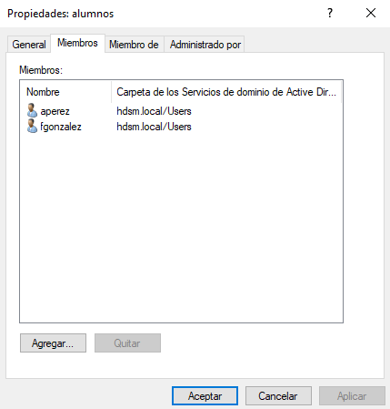
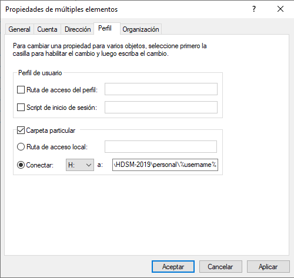
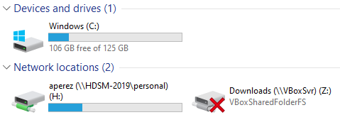

## Creación de usuario

Nos dirigimos al **Administrador del servidor** -> **Herramientas** -> **Usuarios y equipos de Active Directory** -> **Carpeta Users**

Click derecho -> **Nuevo** -> **Usuario**

Configuramos el nombre, contraseña y nombre para el inicio de sesión

## Creación de grupos

En el mismo sitio que para crear los usuario en vez de elegir usuarios elegimos **Grupo**

Configuramos el nombre, el ámbito del grupo lo dejamos en Global

Click derecho sobre el grupo -> **Propiedades** -> **Miembros** -> **Agregar** y elegimos los usuarios que queramos añadir al grupo

## Carpetas personales

Agregamos el rol de **Administrador de recursos del servidor de archivos**

En el panel del **Administrador del servidor** -> **Servicios de archivos y de almacenamiento** -> **Recursos compartidos** -> **Nuevo recurso compartido**

El perfil lo dejamos en el segundo, lo alojaremos en la ruta C:\

El nombre de la carpeta pondremos "personal$"

En los permisos compartir añadimos Usuarios del dominio quitando el grupo Todos

Las propiedades de administración son para **Archivos de usuario**

Sin ninguna cuota y la creamos

Una vez creada tenemos que dirigirnos a **Herramientas** -> **Usuarios y equipos de Active Directory** y donde creaste los usuarios click derecho -> **Propiedades**, en la pestaña **Perfil**

Marcamos la casilla de **Carpeta particular** y **Conectar** elegimos H: y ponemos la siguiente ruta \\HDSM-2019\personal$\%username%

Ahora conectamos al cliente, y comprobamos la carpeta

## Carpetas compartidas por un grupo

Creamos un recurso compartido de la misma manera que antes

En los permisos de compartir ponemos al grupo alumnos y le damos control total

Vamos al cliente y nos intentamos conectar con \\HDSM-2019\apuntes

[Volver](../../index.md)